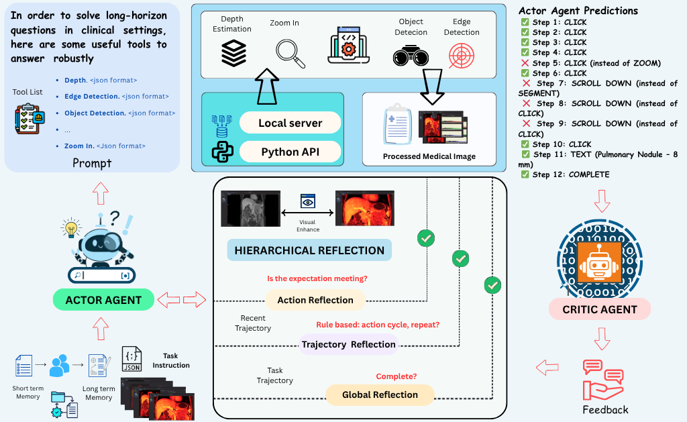
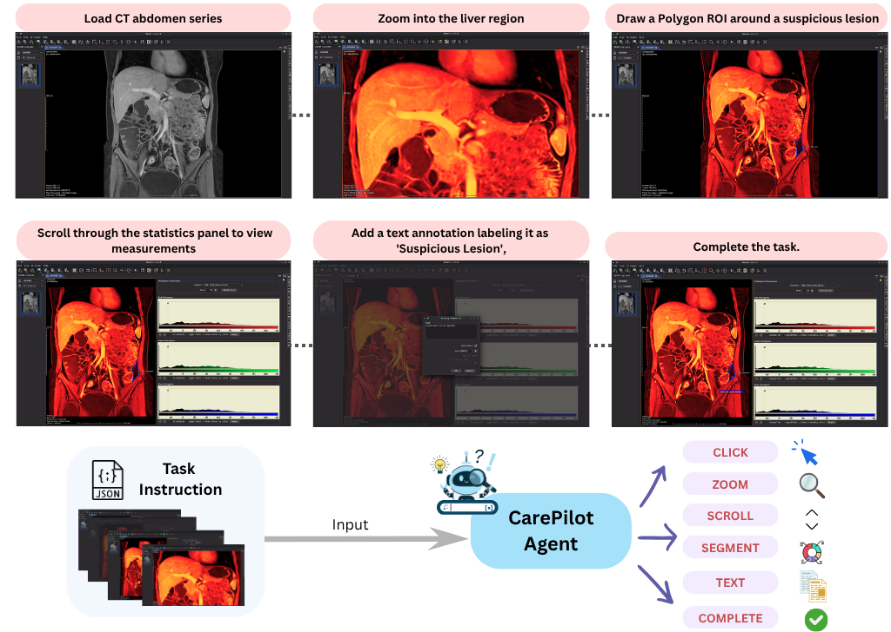
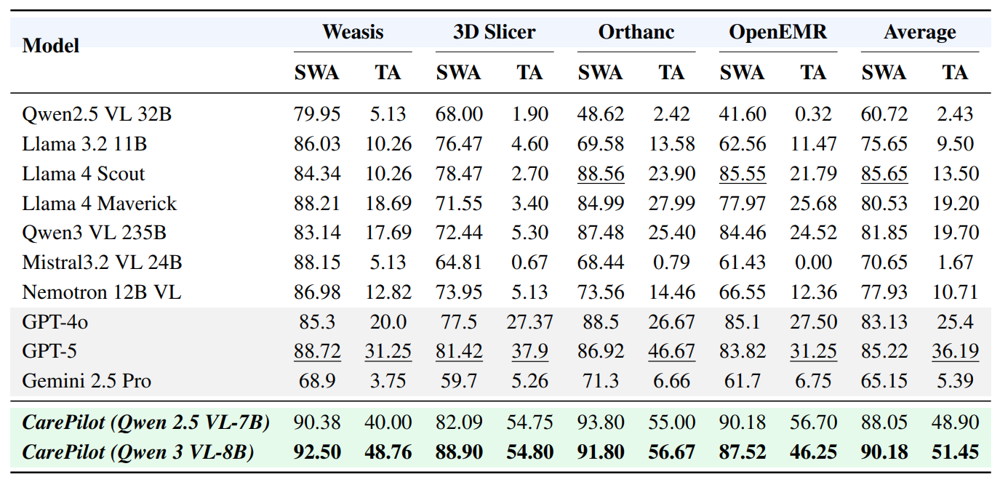

# CarePilot: A Multi-Agent Framework for Long-Horizon Computer Task Automation in Healthcare

<p align="center">
  <a href="https://arxiv.org/abs/2603.24157"></a>
  <a href="https://arxiv.org/pdf/2603.24157"></a>
  <a href="https://huggingface.co/datasets/Agcs12/CareFlow"></a>
  <a href="https://akashghosh.github.io/Care-Pilot/"></a>
  
</p>

> **[CVPR 2026]** CarePilot: A Multi-Agent Framework for Long-Horizon Computer Task Automation in Healthcare
> Akash Ghosh · Tajamul Ashraf · Rishu Kumar Singh · Numan Saeed · Sriparna Saha · Xiuying Chen · Salman Khan
> IIT Patna &nbsp;|&nbsp; Mohamed bin Zayed University of Artificial Intelligence

---

## Abstract

Multimodal agentic pipelines are transforming human–computer interaction by enabling efficient and accessible automation of complex, real-world tasks. However, recent efforts have focused on short-horizon or general-purpose applications (e.g., mobile or desktop interfaces), leaving long-horizon automation for domain-specific systems, particularly in healthcare, largely unexplored.

To address this, we introduce **CareFlow**, a high-quality human-annotated benchmark comprising complex, long-horizon software workflows across medical annotation tools, DICOM viewers, EHR systems, and laboratory information systems. On this benchmark, existing vision–language models (VLMs) perform poorly, struggling with long-horizon reasoning and multi-step interactions in medical contexts.

To overcome this, we propose **CarePilot**, a multi-agent framework based on the actor–critic paradigm. The Actor integrates tool grounding with dual-memory mechanisms — long-term and short-term experience — to predict the next semantic action from the visual interface and system state. The Critic evaluates each action, updates memory based on observed effects, and either executes or provides corrective feedback to refine the workflow. Through iterative agentic simulation, the Actor learns to perform more robust and reasoning-aware predictions during inference.

Our experiments show that **CarePilot** achieves state-of-the-art performance, outperforming closed-source and open-source multimodal baselines by approximately **15.26%** and **3.38%**, on our benchmark and out-of-distribution dataset, respectively.

---

## Overview

CarePilot consists of two main components:

1. **Agentic Pipeline**: An Actor–Critic agent system that processes long-horizon healthcare GUI tasks through tool grounding, dual-memory reasoning, and hierarchical reflection.
2. **Finetuning**: Supervised fine-tuning (SFT) of vision-language models on Critic-augmented trajectories generated by the agentic pipeline.

---

## Architecture



An Actor–Critic multi-agent architecture governs hierarchical decision-making for long-horizon healthcare workflows. At each step, the **Actor** observes the current interface and instruction, integrates tool-grounding signals, and its past experience stored in short- and long-term memories, and predicts the next semantic action. The **Critic** evaluates outcomes, provides corrective feedback, and updates both memory buffers to guide subsequent decisions.

---

## Framework Deep Dive

### 1. Tool Grounding

Before predicting any action, CarePilot enriches its perception of the GUI using four lightweight modules:

| Tool | What it does |
|---|---|
| **UI Object Detection** | Open-vocabulary bounding-box localization of widgets, panels, and controls |
| **Zoom/Crop** | Magnifies fine-grained controls that are hard to parse at full resolution |
| **OCR** | Extracts text–box pairs for patient IDs, series names, study dates, and LIS codes |
| **Template/Icon Matching** | Identifies toolbar icons robustly across themes, scaling, and locales |


---

### 2. Dual-Memory Design

Long-horizon healthcare workflows require reasoning over dozens of interdependent steps. CarePilot maintains two complementary memory buffers updated at every step:

#### Short-Term Memory (STM)

**Stores:** A snapshot of the most recent decision cycle.

**Role:** Feeds the *Action Reflector* level of hierarchical reflection. When the Critic rejects an action, the Action Reflector compares consecutive states using STM to detect **local grounding or perception errors** (e.g., confusing a CLICK with a ZOOM when both target visually similar elements).

#### Long-Term Memory (LTM)

**Stores:** A compact rolling trajectory embedding.

**Role:** Feeds both the *Trajectory Reflector* (detects stalled progress across recent steps) and the *Global Reflector* (evaluates full-trajectory goal consistency). These reflectors write corrective signals back into LTM, creating a self-correcting loop over the full workflow.


---

### 3. Actor–Critic Framework

Both agents are instantiated from the same VLM backbone (**Qwen-VL 2.5-7B** or **Qwen 3 VL-8B**), differing only in their functional roles and input conditioning.

**Actor** — at time t, samples a semantic action:
```
a_t ~ π_θ(a_t | x_t, g, φ_t, M^S_t, M^L_t)
```

**Critic** — evaluates the Actor's proposal:
```
Q_φ(x_t, g, a_t, M^S_t, M^L_t) → r̂_t ∈ [0, 1]
```

If `r̂_t > τ`: action is accepted, both memories are updated, and the workflow advances.
If `r̂_t ≤ τ`: hierarchical reflection is triggered.

#### Hierarchical Reflection (3 Levels)

When the Critic rejects an action, it applies reflection at three progressively wider scopes:

| Level | Component | Scope | Writes to |
|---|---|---|---|
| 1 | **Action Reflector** | Compares (x_t, x_{t+1}) — detects local grounding/perception errors | STM |
| 2 | **Trajectory Reflector** | Inspects window {a_{t-k}, …, a_t} — detects stalled progress or violated preconditions | LTM |
| 3 | **Global Reflector** | Evaluates full trajectory {a_1, …, a_t} — checks goal consistency, decides if task is complete | LTM |

The resulting feedback updates the corresponding memories:
---

### 4. How the SFT Training Dataset Is Created

CarePilot's training uses a **Critic-distillation** pipeline. The Actor–Critic system first *simulates* complete trajectories on CareFlow tasks, the Critic corrects mistakes, and the resulting augmented trajectories form the SFT training corpus. At inference time, the Critic is discarded — its reasoning is baked into the Actor's weights.

## CareFlow Benchmark



**CareFlow** is the first large-scale, human-annotated benchmark for long-horizon healthcare software automation. It covers four major categories of clinical software:

| Category | Platforms |
|---|---|
| DICOM viewing & infrastructure | Orthanc, Weasis |
| Medical image computing & annotation | 3D Slicer |
| Hospital information & EMR systems | OpenEMR |
| Laboratory information systems | OpenHospital (OOD) |

### Dataset Statistics

| Split |  Tasks | Avg. Steps | Min | Max | OOD | Actions |
|---|---|---|---|---|---|---|
| Train | 735 | 12.7 | 7 | 22 | — | 6 |
| Test | 315 | 12.9 | 9 | 24 | 50 | 6 |
| **Total** | **1050** | — | — | — | **50** | **6** |

Inter-annotator agreement: **κ = 0.78** (Cohen's kappa) on the independently validated test set.

### Action Space

| Action | Description |
|---|---|
| `CLICK` | Move the cursor and click at the specified item |
| `SCROLL` | Scroll the active view vertically or horizontally by n units |
| `ZOOM` | Adjust the magnification level of the displayed image or view |
| `TEXT` | Type string s into the focused input field |
| `SEGMENT` | Create or edit a segmentation / ROI on the displayed medical image |
| `COMPLETE` | Mark the workflow or task as finished |

### Four-Stage Annotation Pipeline

**(i) Crafting Seed Tasks**
Domain experts mapped each software system's real-world usage patterns, functional scope, and operational constraints through structured workshops. They identified core activities performed by practitioners and distilled a seed inventory of executable, end-to-end tasks representative of authentic clinical workflows.

**(ii) Expanding Diversity and Scale**
Systematic generation of diverse variants per seed instruction: controlled substitutions (e.g., "MRI report" → "X-ray report"), parameter adjustments (filenames, thresholds), and procedural edits (adding/omitting optional zoom or configuration steps) — all while preserving intent and executability.

**(iii) Stepwise Annotation of GUI States**
Trained annotators decomposed each task into atomic steps. For every step, they captured the corresponding screenshot and labeled the precise next semantic action required to progress within the interface, producing fully grounded screenshot–action pairs for long-horizon reasoning.

**(iv) Quality Assurance and Filtering**
Retained only trajectories meeting three strict criteria:
- (a) Chronological consistency of screenshots
- (b) Task completeness with optimal or near-optimal step sequences
- (c) Clear, unambiguous natural-language instructions

Two domain experts supervised the process; two trained interns populated the images and task formulations under their guidance.

---

## Performance Results




### OOD — OpenHospital

| Model | SWA | TA |
|---|---|---|
| GPT-5 | _79.70_ | _34.80_ |
| Llama 4 Maverick | 73.71 | 27.27 |
| **CarePilot (Qwen 2.5 VL-7B)** | 77.93 | **36.40** |
| **CarePilot (Qwen 3 VL-8B)** | **79.27** | **38.18** |

CarePilot (7B) surpasses GPT-5 on Task Accuracy (36.40 vs 34.80) on a platform **never seen during training**.

### Ablation Study

| Tool Grounding | LTM | STM | SWA | TA |
|---|---|---|---|---|
| ✗ | ✓ | ✓ | 73.20 | 9.37 |
| ✓ | ✗ | ✓ | 82.10 | 23.67 |
| ✓ | ✓ | ✗ | 80.40 | 30.42 |
| ✓ | ✓ | ✓ | **88.05** | **48.90** |

### Critic Impact

| Configuration | SWA | TA |
|---|---|---|
| Actor only (no tools) | 65.37 | 3.75 |
| Actor + Tool Grounding (no Critic) | 72.98 | 12.50 |
| **Full CarePilot (Qwen 2.5 VL-7B)** | **88.05** | **48.90** |

### Performance vs. Task Length

| Steps | Qwen 3 VL-8B | Qwen 2.5 VL-7B |
|---|---|---|
| < 10 | 65.41% | 64.66% |
| 10–15 | 45.67% | 54.32% |
| 15–20 | 31.25% | 34.37% |
| > 20 | 27.02% | 27.02% |

---

## Repository Structure

```
CarePilot/
├── Agentic_Pipeline/        # Actor-Critic agentic pipeline
│   ├── main.py              # Entry point
│   ├── controllers/         # Task controller logic
│   ├── agents/              # Actor and Critic agent implementations
│   ├── tools/               # Visual grounding tools (detection, OCR, zoom)
│   ├── memory/              # STM and LTM implementations
│   └── README.md
├── Finetuning/              # SFT fine-tuning code
│   ├── training/            # Training scripts (train.py, config.py)
│   └── test/                # Evaluation scripts (evaluate.py)
├── figures/                 # Architecture diagrams and result plots
├── requirements.txt         # Unified dependencies
└── README.md                # This file
```

---

## Quick Start

### Prerequisites

- Python 3.8+
- CUDA-capable GPU (recommended for fine-tuning)
- API keys for:
  - Deep Infra (for agentic pipeline baselines)
  - HuggingFace (for datasets and models)

### Installation

1. Clone the repository:
```bash
git clone <repository-url>
cd CarePilot
```

2. Install dependencies:
```bash
pip install -r requirements.txt
```

For fine-tuning, install PyTorch with CUDA support:
```bash
# For CUDA 11.8
pip install torch torchvision torchaudio --index-url https://download.pytorch.org/whl/cu118

# CPU only
pip install torch torchvision torchaudio
```

3. Set up environment variables:
```bash
export HF_TOKEN="your_huggingface_token"
export DEEPINFRA_TOKEN="your_deepinfra_token"
```

Or create a `.env` file:
```bash
echo "HF_TOKEN=your_huggingface_token" > .env
echo "DEEPINFRA_TOKEN=your_deepinfra_token" >> .env
```

---

## Usage

### Agentic Pipeline

Navigate to the Agentic Pipeline directory:
```bash
cd Agentic_Pipeline
```

**Run a single task:**
```bash
python main.py --mode original --goal "Load the MRI scan, create a segmentation of the tumor, and measure its volume."
```

**Run on the CareFlow dataset:**
```bash
python main.py --mode dataset --max_tasks 5
```

**Run with enhanced components (full CarePilot):**
```bash
python main.py --mode enhanced --goal "Load the MRI scan, create a segmentation of the tumor, and measure its volume."
```


See [Agentic_Pipeline/README.md](Agentic_Pipeline/README.md) for full details.

---

### Fine-tuning

#### Step 1 — Generate Critic-Augmented Trajectories (SFT Data)

```bash
cd Agentic_Pipeline
python main.py --mode dataset --max_tasks 735 --start_task 0
# Outputs: task_results.csv containing (screenshot, instruction, tool signals, memories, corrected action) tuples
```

#### Step 2 — Train the Actor

```bash
cd Finetuning/training
python train.py \
    --train_csv path/to/task_results.csv \
    --model_name Qwen/Qwen3-VL-8B-Instruct \
    --output_dir outputs/carepilot_qwen3 \
    --num_epochs 2 \
    --learning_rate 2e-4
```

#### Step 3 — Evaluate

```bash
cd Finetuning/test
python evaluate.py \
    --model_path ../training/outputs/carepilot_qwen3 \
    --test_csv path/to/test_results.csv \
    --output_dir results/
```


**Evaluation arguments:**

| Argument | Description |
|---|---|
| `--model_path` | Path to fine-tuned model |
| `--test_csv` | Path to test CSV |
| `--output_dir` | Output directory for results |
| `--batch_size` | Batch size for evaluation |
| `--max_tasks` | Maximum tasks to evaluate |

See [Finetuning/README.md](Finetuning/README.md) for full details.

---

## Configuration

API keys are set via environment variables:
- `HF_TOKEN` — HuggingFace API token
- `DEEPINFRA_TOKEN` — Deep Infra API token

Config files:
- `Agentic_Pipeline/config.py`
- `Finetuning/training/config.py`

---

## Testing Individual Components

**Test Agentic Pipeline import:**
```bash
cd Agentic_Pipeline
python -c "from controllers.task_controller import TaskController; print('TaskController imported successfully')"
```

**Test Fine-tuning config:**
```bash
cd Finetuning/training
python -c "from config import get_config; print('Config loaded successfully')"
```

---

## Citation

If you find our work useful or use it in your research, please consider citing:

```bibtex
@article{ghosh2026carepilot,
  title={CarePilot: A Multi-Agent Framework for Long-Horizon Computer Task Automation in Healthcare},
  author={Ghosh, Akash and Ashraf, Tajamul and Singh, Rishu Kumar and Saeed, Numan and Saha, Sriparna and Chen, Xiuying and Khan, Salman},
  journal={arXiv preprint arXiv:2603.24157},
  year={2026}
}
```
